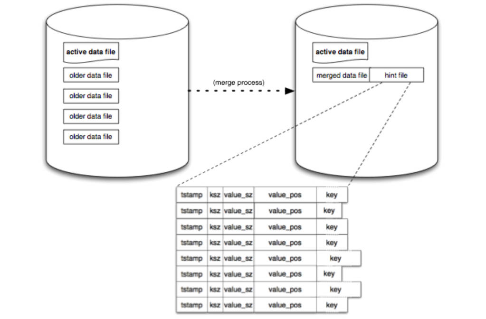

--- 
title:  "[kv存储引擎] golang实现"
description: "基于bitcask实现的KV存储引擎"
tags:  ["golang", "bitcask"]
categories: ["实战项目"]
date:  "2024-10-31"
---

## 1. KV基础
KV存储，即键值数据存储，是一种基于键值对的存储方式，将数据存储为一个由键和值组成的二元组

KC存储的应用场景：作数据库的缓存层、分布式系统中的元数据、分布式锁

> 最常见的KV数据库是Redis，Redis是基于内存的KV数据库，虽有持久化策略AOF和RDB，但是本质上还是面向内存设计的，数据收到内存的限制

而本项目`go-bitDB`是面向磁盘的KV数据库

KV数据库的数据存储模型大致分为两种，一个B+树，一个是LSM树
- B+树：BolitDB
- LSM树：LevelDB、RocksDB

## 2. 了解bitcask存储模型
[[bitcask-intro.pdf]]

bitcask存储模型是由提供分布式存储系统的企业Riak提出
对bitcask存储模型的理想：
- 读写低延迟
- 高吞吐，特别对大量的随机写入
- 能处理超过内存容量的数据
- 崩溃恢复好，保证快速恢复，进来不丢失数据
- 简单的备份和恢复策略
- 相对简单，易懂的代码结构和数据存储格式
- 在大数据量下，性能有保障
- 能够自由使用在Riak系统

一个bitcask实例就是系统上的一个目录，并且限制同一时刻只能有一个进程打开这个目录。
目录中多个文件同一个刻只能有一个活跃的文件用于写入新的数据

当活跃文件写到一个阈值后，就会被关闭，成为旧的数据文件，并打开一个新的文件用于写入
所以一个目录里面就是：一个活跃文件和多个旧文件

当前活跃文件的写入是追加(append only)，这表示可以利用顺序IO，不会有多余的磁盘寻址，减少了磁盘寻道实践，最大限度保证吞吐

写入文件的数据格式，其字段为
- `crc`：数据校验，防止数据被破环、篡改
- `timestamp`：写入数据的时间戳
- `ksz`：key size，key的大小
- `value_sz`：value size，value的大小
- `key`：用户实际存储的key
- `value`：用户实际存储的value 

```text
crc | tstamp | ksz | value_sz | key | value
```

每次写入都是追加到活跃文件中，删除操作实际上也是一次追加写入

当下次merge的时候，才会将这种无效的数据清理。旧数据在merge前将一直存在于磁盘文件中，旧数据的删除操作是新追加一条标识其被删除的记录

在追加写入磁盘文件后，更新内存中的数据结构，叫`keydir`，实际是全部key的一个集合，存储的是key到一条磁盘文件数据的位置

`keydir`根据需求可以使用哈希表、B树、跳表等天然支持排序的数据结构

```text
key --> file_id | value_sz | value_pos | tstamp
key --> file_id | value_sz | value_pos | tstamp
	......
key --> file_id | value_sz | value_pos | tstamp
```
`keydir`在内存中存储一条数据在磁盘中的最新位置，旧数据等待merge的时候清理

所以读取数据的过程将是：首先根据key从内存中读取到对应的记录，得到该key在磁盘中存储的位置，然后在磁盘上找到对应的数据文件，以及文件中的具体偏移量

随着 bitcsk 存储的数据越来越多，旧数据也可能越来越多，这里需要一个merge的过程来清理所有无效的数据
merge过程会遍历所有不可变的旧数据文件，将所有有效的数据重新写到新的数据文件中，并且将旧的数据文件删除



merge完成后，会为每个数据文件生成一个hint文件，hint文件可以看作全部数据的索引，它不存储实际的value
hint文件在bitcask启动的时候直接加载，快速构建索引，不用全部重新区加载数据文件

bitcask总结：
-  bitcask很快，查询和写入都快，读写都只有一次磁盘IO
- 写入数据是顺序IO，保证吞吐量
- 内存不存储实际的value，在value比较大的情况下，可以处理超过内存容量的数据
- 提交日志和数据文件是同一个文件，数据的崩溃恢复能够得到保证
- 备份和恢复非常简单，只需拷贝整个数据目录
- 设计简洁，数据文件格式易懂，易管理
总的来说，bitcask是一个简洁优雅、高效的存储引擎

最后是，bitcask的一些面向用户和API操作接口
```text
// 打开一个bitcask数据库实例，使用传入的目录路径
// 保证进程对该目录具有可读可写权限
bitcask::Open(Directory Name);

// 通过key获取存储的 value
bitcask::Get(key);

// 存储key 和 value
bitcask::Put(key, value);

// 删除一个key
bitcase::Delete(key);

// 获取全部key
bitcase::list_keys();

// 遍历所有数据，执行函数Fun
bitcase::Fold(Fun);

// 只需merge，清理无效数据
bitcase::Merge(Directory Name);

// 刷盘，将所有缓存区的写入持久化到磁盘中
bitcase::Sync();

// 关闭数据库
bitcase::Close();
```

## 3. 内存和磁盘设计

bit-db的内存和磁盘设计遵循bitcask-intro论文的描述。分两部分
- 内存中的数据如何存放
- 磁盘中的数据如何组织

### 3.1 内存设计

在内存中，我们需要一种支持高效插入，读取，删除数据的数据结构，并且需要数据高效遍历，最好使用天然支持排序的数据结构B树、跳表、红黑树等

可以选择B树，可以直接使用开源项目[google-btree](https://github.com/google/btree)

由于需要使得内存结构的选择更加灵活，定义一个通用的抽象接口，接入不同的数据结构
当一个新的数据结构想要接入，只需要实现该抽象接口
```go
// Indexer 索引接口
type Indexer interface {
	Put(key []byte, pos *data.LogRecordPos) bool
	Get(key []byte) *data.LogRecordPos
	Delete(key []byte) bool
}
```
后续以自适应基数树和跳表作为另一个内存索引

### 3.2 磁盘设计
磁盘设计目前支持标准的系统文件IO，后续其他IO类型例如MMap内存映射或者文件IO系统都可以接入

定义一个`IOManager`接口，将IO操作抽象化
```go
// IOManager 抽象 IO 管理接口，可以接入不同的IO类型，目前支持标准文件 IO
type IOManager interface {

    // Read 从文件的给定位置读取对应的数据
    Read([]byte, int64) (int, error)

    // Write 写入字节数组到文件中
    Write([]byte) (int, error)

    // Sync 持久化数据
    Sync() error

    // Close 关闭文件
    Close() error
}
```

对于数据文件从操作，增加一个目录文件来存放data

至此，`go-bitDB`的存储引擎架构就清晰了


## 4. 数据读写删流程

### 4.1 写数据流程
总体分两步：先写磁盘数据文件，再更新内存索引

将数据封装到`LogRecord`里，表示追加写到数据文件到日志文件
```go
type LogRecord struct{
	Key    []byte
	Value []byte
	Type   LogRecordType
}
```
`LogRecord`表示单条数据，由`Type`表示该数据的操作类型，例如插入，删除（墓碑值）...

追加一个写入到数据文件的方法`appendLogRecord`
大致的逻辑如下：
1. 判断当前活跃文件是否存在，不存在可能需要初始化数据文件
2. 判断活跃文件是否到达**阈值**，若到达阈值则关闭活跃文件并打开一个新的数据文件（相当于将活跃文件持久化）
3. 调用数据文件的Write方法写入编码后字节数据，Write之前需要先记录一下目前活跃文件的写偏移offset
4. 最后判断持久化策略，根据策略进行持久化刷盘，调用Sync方法

> 对标准系统IO，向文件写数据实际上会先写到内存缓存区，并且等待操作系统进行调度，将其刷到磁盘中
> 如果缓冲区的内存还没来得及持久化，此时操作系统发生崩溃，可能会导致缓冲区的数据丢失
> 为了避免数据丢失，可以手动调用fsync系统调用，强制将缓冲区的内容刷到磁盘（可自行配置刷盘策略）

磁盘文件写完后，返回数据位置信息（文件fid，偏移量offset），接着需要更新内存索引
将返回的位置信息封装到`LogRecordPos`，接着调用内存索引更新方法

至此写数据流程结束
### 4.2 读数据流程
相对于写数据流程，读数据流程相对简单
1. 根据key去内存索引数据结构中查找数据，如果没有找到，则说明key不存在，直接返回key不存在的错误
2. 在内存索引中找到key，返回对应位置信息`LogRecordPos`
3. 根据位置信息中的文件fid，判断是否是当前活跃文件，如果是，则直接使用活跃文件，否则从旧数据文件中查找
4. 如果根据这个文件fdi没有找到数据文件，则直接抛出数据文件不存在
5. 根据位置信息中的偏移量offet，从数据文件中读取数据，返回key-value

### 4.3 删除数据流程
删除数据流程和写数据流程差不多，删除数据实际上是追加一条墓碑值到数据文件，标识数据被删除

由于删除操作是追加操作，所以需要判断key是否存在，否则删除操作可能导致数据文件膨胀

追加操作完成后，更新索引，调用index的Delete方法

对于磁盘中存在的无效数据，将由后续的merge过程清除

需要注意的是，在bitDB启动的时候，需要对已删除的数据构建的索引进行删除，这是因为bitDB启动的时候，顺序读取数据文件中的信息，一条数据虽然被删除，但是数据的删除标识可能在后续的数据文件中，所以在启动bitDB时，需要对已经删除的记录进行删除，判断到数据的墓碑值，则根据key将内存索引中的数据删除

> 特殊case：
> 当删除数据时，追加的记录到了文件的末尾，如果这条记录恰好是数据文件的最后一条记录，并且这个记录的长度没有超过maxHeaderSize，但是读取header的时候，是按照maxHeaderSize读取，可能造成EOF错误
> 
> 针对case：需要在读取的时候，判断是否超过文件的大小，否则只读取到文件的末尾即可


## 5. 启动流程
在这里将介绍存储引擎如何启动

启动流程分两步：
- 加载数据目录中的文件，打开其文件描述符
- 遍历数据文件中的内容，构建内存索引

启动引擎时，由用户配置选项，例如数据目录（DirPath）、数据文件大小阈值（DataFileSIze）、内存索引类型（IndexType）、总是持久化（SyncWrites）等，后续配置选择可以按需增加

接下来校验配置项，避免无效配置项从而破环数据库内部行为

检验完成后，检查数据目录，没有则创建数据目录

初始化DB实例，在`go-bitDB`里是`type bitDB struct {...}`，存放索引、数据文件等内容

接下来加载数据文件，约定数据文件后缀为`.data`，在数据目录下遍历数据文件，取出文件id
文件名使用该文件id递增，作为数据文件的名称
==使用顺序名称的好处是在加载数据的时候可以顺序读取，顺序IO读取==
最后打开文件id最大的文件，作为活跃文件

读取完配置文件后，开始构建索引文件

从小到达遍历每个文件id，加载数据构建内存索引所需的信息

## 6. 数据文件逻辑
这里重新对数据文件的逻辑进行处理

在`go-bitDB`代码中，定义了`IOManager`接口，以实现不同的文件IO，目前使用标准系统IO实现，具体实现在`file_io.go`文件中
```go
type FileIO struct {
    fd *os.File //  系统文件描述符
}
```
`FileIO`结构体实现了`IOManager`接口，之所以封装了这一层，并提供了抽象接口，起到的作用是屏蔽上层的调用者，并且方便后续接入不同的IO类型，例如MMap，或者自定义的IO系统

在Data实现中的`LogRecord`表示一条数据，`LogRecordPos`表示一个索引数据，`DataFile`表示打开的文件，调用FIleIO的方法实现文件操作

在bitDB实例中，通过调用DataFile.OpenDataFile方法打开一个数据文件，DataFile.ReadLogRocord方法加载数据，进而获取LogRecord数据，在调用Indexer.XXX方法进一步操作LogRecordPos索引数据
大致数据文件逻辑如上

读取LogRecord，根据偏移offset读取指定位置的LogRecord信息
```text
LogRecord定义如下所示：
|        header                    |        Key/Value          |   
crc | type | ksz | value_sz |       key    |     value
```
分为两部分：
- header：存储一些元数据 --> crc校验值、type类型、key的大小、value的大小
- kv：实际存储的key、value数据

header定义了固定长度，其中crc占4字节，type占1字节，ksz和value_sz的大小由存储的key和value决定
由于ksz和value_sz是变长的，在读取时会取header的最大值，即MaxHeaderSize值
反序列化时，解码的ksz和value_sz之后有多余的字节将自动忽略

> 设计变长的原因是为了节省空间，例如ksz定义为uint32，固定占4字节，如果有key的长度为5，那么只需要1字节即可

这里需要注意，在读取数据的时候，通过偏移offset+MaxHeaderSize如果超过了文件的大小，也就是删除操作出现的特殊case

在拿到header后，需要判断ksz和value_sz的值，如果为0，则表示读取到了文件末尾，直接返回EOF错误
否则判断值是否大于0，读取出key和value
再将读偏移offset加上ksz和value_sz的值，读取出一个字节数组，即真实key和value值

最后根据读取的key和value获取对应的crc校验值，与header中的crc比较，如果相等，表示是一条完整的数据，否则说明数据被破环了

## 7. LogRecord 编解码
前提须知：`LogRecord`就是实际写到数据文件中的key，value数据

### 7.1 LogRecord编码
对LogRecord的编码就是将key、value值转化为最终写入到数据文件中的一条日志记录
在Go语言中可以使用自带的`binary`包

`EncodeLogRecord`编码方法，其功能是将传入的LogRecord结构体转化为符合日志记录格式的字节数组

首先将header部分的几个字段写入到对应的字节数组，header几个字段所占空间如下：
- crc：uint32类型，占4字节
- type：byte类型，占1字节
- key_size和value_size：是变长的，每个的最大值为5字节

header编码后，将key和value的数据拷贝到字节数组中

最后对数据做crc校验，也需要将这个值存储到磁盘中，方便获取的时候进行比较，判断数据的有效性

### 7.2 LogRecord解码
从数据文件中读取日志记录LogRecord，先按照Header的最大长度读取header部分的字节数，然后对其进行解码，获取编码时的对应长度获取crc校验值、type、key_size和value_size

再根据key_size和value_size读出实际的key/value的值

最后校验读取出来的crc值时候和LogRecord对应的crc值是否相等，如果不相等的话则说明这条数据存在错误，返回对应的错误信息

## 8. Close、Sync、迭代器

### Close 关闭数据库

close方法关闭数据库，即把数据库相关的资源清理、释放
一是将当前活跃的文件关闭；二是将旧文件关闭。

如果有其它资源应该释放，也添加到Close方法中

### Sync 持久化数据库
负责将数据文件在缓冲区的内容刷盘到磁盘，保证数据不丢失

调用Sync方法，主要针对活跃文件，因为活跃文件写满后，转化为旧数据文件，已经持久化完毕，所以只需对活跃文件进行持久化

### 迭代器
这里提供了两个方法 list_keys 和 fold，都对key进行遍历，不同的是 fold 方法需要取出对应的value

key的信息均保存在内存中，所以直接从内存索引中取出即可

由于索引类型有多种，可以定义一个抽象的迭代器接口，让每一个具体的索引去实现迭代器，后续只需要调用这个迭代器获取索引中的数据即可

迭代器的定义大致如下：
```
type Iterator interface {
	Rewind()                       // 重回迭代器起点
	Seek(key []byte)          // 根据传入key查找第一个大于（小于）等于的目标key
	Nex()                            // 跳转到下一个key
	Valid() bool                  // 是否有效，即是否已经遍历所有key，用于退出遍历
	Key() []byte                 // 当前遍历位置的 key 数据
	Value() *data.LogRecordPos // 当前遍历位置的 value 值
	Close()                              // 关闭迭代器，释放相应资源
}
```

索引的迭代器实现后，在数据库层增加一个迭代器，提供用户使用

LIstKeys：针对 ListKeys 方法，只需要key，所以可以获取索引的迭代器接口，然后遍历所有的key即可
Fold：相比较于 ListKeys 方法，多了一个从磁盘获取value的步骤

这里定义一个判断函数，由用户自定义，如果这个函数返回false，则遍历终止

## 9. WriteBatch 原子写

事务的基本概念：一个事务表示一批操作要么全部成功，要不全部失败回滚，不会停留在中间态，造成数据的不一致

事务的定义有四个属性：ACID，即原子性、一致性、隔离性、持久性
- 原子性：描述事务不可分割，要么全程执行成功，要么失败回滚
- 一致性：事务开始和结束后数据的完整性没有被破环
- 隔离性：数据库可以支持多个并发执行的事务对数据进行修改和读取，隔离性可以防止多个事务执行时，由于交叉执行而导致数据的不一致
- 持久性：事务执行成功后，对数据的修改是永久的

原子性保证：通过==WAL（Write Ahead Log）==实现
隔离性保证：隔离性定义四个标准
	- 读未提交（存在问题：脏读）
	- 读提交（存在问题：不可重复读）
	- 可重复读（存在问题：幻读）
	- 串行化

### 9.1 并发控制的实现
隔离性主要控制多个并发事务的正确性，避免由于多个事务交叉执行，导致数据不一致

- 两阶段锁（Two-Phase Locking）
	在事务执行过程中，对需要操作的对象加锁，如果其他事务也需要操作同一个对象，将等待持有锁的事务释放锁，或者因为未获取锁而回滚，避免发生死锁
	在类LSM的存储引擎中，一般不采用两阶段锁来实现事务，因为LSM存储模型中，数据本身具有多版本的特征
- 多版本并发控制（MVCC）
	MVCC是在修改一条数据时，先不对原有的数据进行修改，而是增加一条数据，并标识其版本，这样可以实现读写事务之间互不阻塞，因为它们在执行过程中维护了自己的数据版本

基于MVCC实现的事务隔离方式，一般叫做快照隔离（SI），SI并不是标准定义中事务的四种隔离级别，它的基本思路是每个事务都持有一个自己的快照，事务读取数据时会基于事务开始时的一个快照，其他事务不会其造成影响，当事务提交后，它的修改才会被其他事务看到

SI基本解决脏读、不可重复读、幻读问题，但是仍然存在写偏斜（Write Skew）的问题
而后续提出的串行化快照隔离（SSI），则会对读取过的数据进行跟踪，并在提交的时进行冲突检测

SSI的大致思路：
写数据：
- 将数据暂存到内存中，并记录到每个key到一个集合中，便于冲突检测
- 提交事务：
	- 加锁保证线程安全
	- 检测冲突，当事务读取过的key是否被其他事务修改过，如果是，则说明有冲突，事务放弃提交，回滚
	- 获取当前最新事务序号（序号为全局递增，每个事务分配一个序列号）
	- 将所有需要写入的数据，key进行编码，加上事务序列号
	- 将数据批量写到存储引擎，保证原子性和持久性
	- 写完后更新内存索引
读数据：
- 从当前事务的数据集合中获取，如果获取到直接返回
- 未获取到，则 key+当前事务的序列号，从存储引擎中查找
- 将读过的数据记录下来，便于在提交事务时进行冲突检测

### 9.2 WriteBatch
在`go-bitDB`的存储引擎中，将key维护在内存中，如果在此基础上实现MVCC，那么会在内存中维护所有的key、位置索引、版本信息，可能造成内存容量的急剧膨胀

这里实现一个简单的事务，利用一个全局锁保证串行化，实现简单的ACID事务

>[badger事务过程](https://zhuanlan.zhihu.com/p/395229054)
>[go_badgar_transaction.md](https://github.com/rfyiamcool/notes/blob/main/go_badger_transaction.md)
>[数据内核杂谈十：事务、隔离、并发](https://www.infoq.cn/article/teJA7X43BO2alp6rLCWk)
>[数据库内核杂谈十一：事务、隔离、并发](https://www.infoq.cn/article/KyZjpzySYHUYDJa2e1fS)
>[数据库内核杂谈十二：事务、隔离、并发](https://www.infoq.cn/article/gaOh3me9PmJBiQFD2j15)
>[concurrency-control](https://catkang.github.io/2018/09/19/concurrency-control.html)
>[Concurrent ACID Transactions in Badger](https://dgraph.io/blog/post/badger-txn/)
>[数据库隔离级别分析](https://tech.ipalfish.com/blog/2020/03/26/isolation/)

设计思路：
保证一个批量操作的原子性

具体实现方案如下：
将用户的批量操作缓存起来，保存到一个内存数据结构中，然后提供一个提交的接口`Commit`，表示将用户的批量操作全部写入到磁盘文件中，并更新内存索引

正常情况下，批量操作全部写入到磁盘文件然后更新内存索引
但是如果在写磁盘的时候发生异常，例如系统崩溃了，那数据可能就只写了一半。这样数据库在启动后这部分的数据依然会被正常识别，被当作有效数据，这样原子性就不能保证了

解决方案是：给这一批数据添加唯一标识，成为序列号 Seq Number，可以理解为事务ID，这个Seq Number是全局递增的，每一个事务的数据在提交的时候都会获取一个Seq Number，并保证后续的Seq Number都比前面的更大

提交事务时，每一条日志记录都有一个Seq Number，并写到数据文件中，然后在每个事务的最后增加一个识别事务完成的日志记录

在数据库启动时，如果判断到日志记录有Seq Number，那么先不更新内存索引，而是将它暂存起来，直到读取到一条标识事务完成的记录，说明事务正常提交，就可以将这一事务的内存索引更新到内存中

## 10. Merge概况
merge的主要功能是清理磁盘上的无用数据，避免由于数据逐渐增多，且无效数据过多，导致存储引擎的数据目录空间的膨胀

merge的主要设计是1.清理旧数据，重写有效的数据，2.生成只包含索引的hint文件，且保证merge过程不对前台的正常读写造成太大的影响

### 10.1 清理无效数据
清理无效数据有多种方法：

- 第一种：按照编号从小到大读取数据文件，并且依次取出每一条日志记录，然后跟内存中的索引进行比较，如果和索引中对应的偏移 offset和文件 id一致，说明是有效数据，然后直接调用Put接口重写这条数据即可，一个文件中的数据重写完成了，将旧文件删除。
  但是这样会与外层调用者竞争Put接口，增加锁竞争
  还有一个需要处理的点，当一个文件的数据重写到一半时，发生崩溃，这时新的数据文件中有新重写的数据，而旧的文件不能删除，出现数据冗余，解决这个问题的方案是开启一个事务执行，但是只有在事务提交成功后，才删除旧文件，如果一个文件中的数据太多，在提交事务前，一般将数据缓存到内存中，这样可能造成内存容量的膨胀
- 换一种思路，使用一个临时文件夹，假设叫merge，在临时目录启动一个数据库实例，与原正在运行的数据库实例互不冲突。将原来的目录中的数据逐一读取，并取出其中的日志记录和内存索引进行比较，如果是有效的，将其重写到merge的数据目录中，避免与原目录的竞争

### 10.2 hint索引文件
在重写数据到merge目录的时候，会获取到对应日志记录的索引信息，将这个索引和原始的key保存到一个hint文件即可，hint可以沿用数据文件的结构，采用日志追加的方式

### 10.3 merge校验
在merge的过程中，如果出现异常，例如进程退出、或者系统崩溃等，导致merge没有完成

解决方案：在merge过程完成后，在磁盘上增加一个merge完成的文件，当重启数据库的时候，查看是否有对应的merge目录，找到目录说明发生过merge，然后在这个目录中查找是否有merge完成的文件，没有的话则说明这时一次无效的merge，直接将merge目录删除

如果是有效的merge，那么这个目录的数据文件存放的都是有效的数据，以及一个hint的索引文件，将这些数据文件拷贝到原始数据目录中，然后把对应的索引文件也拷贝过去，把临时merge目录删除

## 11. 内存索引优化


